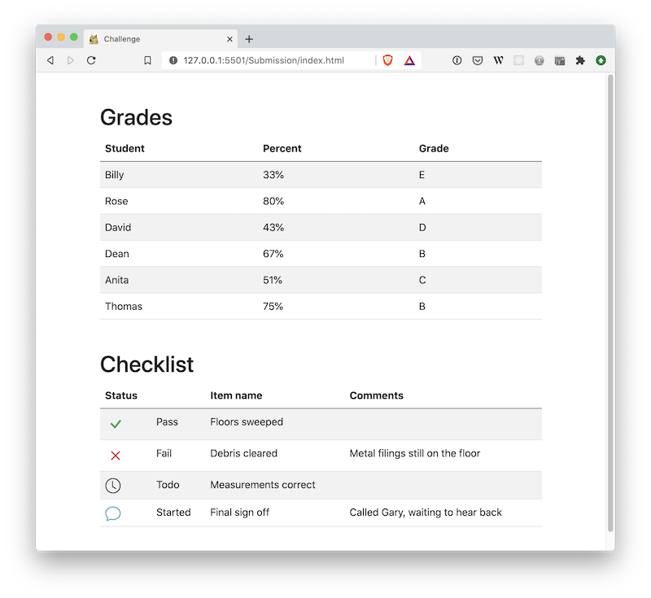
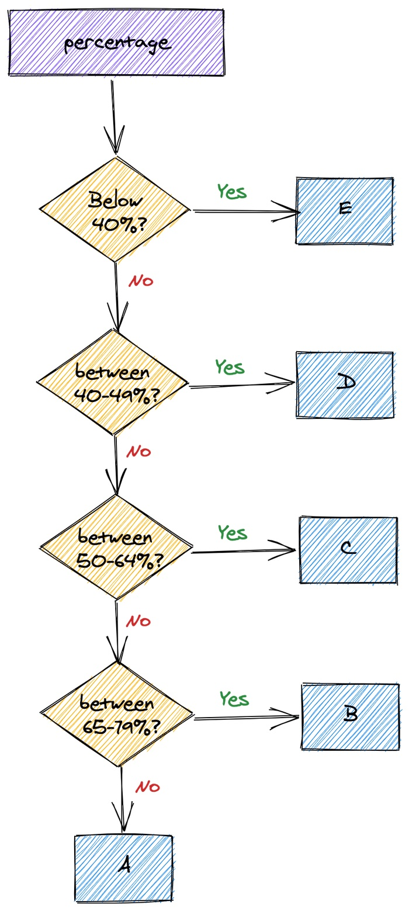
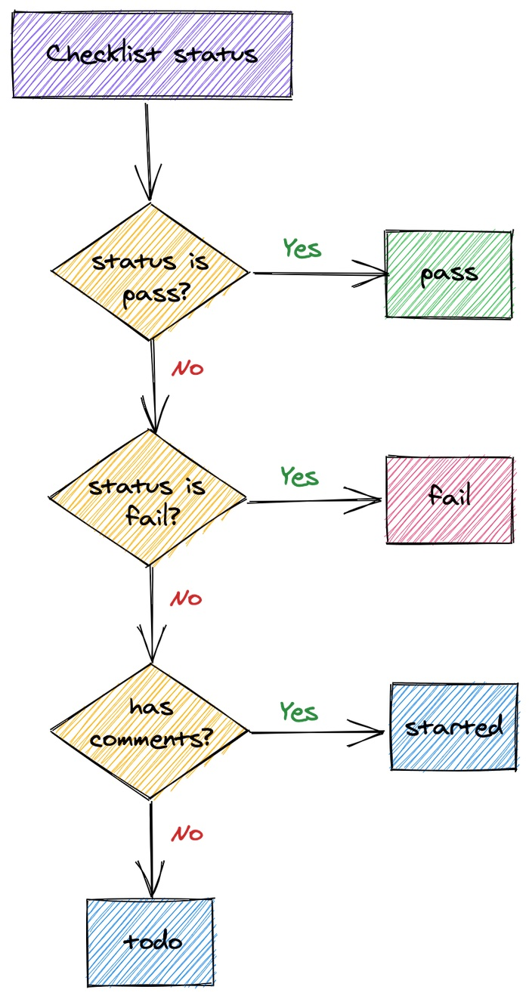

# 01 Exercise - JS Conditionals

## Brief

Calculate student grades, and checklist statuses using conditionals in JavaScript

## Rationale

Making decisions using conditionals in JavaScript is fundamental to making any web application.

## Instructions Part A - Calculate grades

Use the following flow chart to complete the requirements for calculating student grades

1. Open `Submission/static/js/script.js` and find the existing `calculateGrade` function
2. Open `Submission/index.html` in your browser using Live Server. The _Grades_ table should update as you complete your JavaScript
3. Complete the logic in `calculateGrade` by using the flow chart above. `calculateGrade` should return the correct grade, depending on the percentage that is passed in
   - **Tip** use `console.log(percentage)` to see the percentage value that is being provided

**Acceptance criteria**

- If a percentage is below 40%, `calculateGrade` should return `"E"`
- If a percentage is between 40% and 49%, `calculateGrade` should return `"D"`
- If a percentage is between 50% and 64%, `calculateGrade` should return `"C"`
- If a percentage is between 65% and 79%, `calculateGrade` should return `"B"`
- If a percentage is over 79%, `calculateGrade` should return `"A"`

## Instructions Part B - Calculate statuses

Use the following flow chart to complete the requirements for calculating checklist statuses

1. Open `Submission/static/js/script.js` and find the existing `calculateStatus` function
2. Open `Submission/index.html` in your browser using Live Server. The _Checklist_ table should update as you complete your JavaScript
3. Complete the logic in `calculateStatus` by using the flow chart above. `calculateStatus` should return the correct status each time the function is called, depending on the arguments that are being passed index

**Acceptance criteria**

- If `status` is `"pass"`, `calculateStatus` should return `"pass"`
- If `status` is `"fail"`, `calculateStatus` should return `"fail"`
- If `status` is `undefined`, and `comments` is not empty, `calculateStatus` should return `"started"`
- If `status` is `undefined`, and `comments` is empty, `calculateStatus` should return `"todo"`

---

# Submit your Exercise

- [ ] Commits are pushed to GitHub
- [ ] Automated tests pass in GitHub

---

## Exercise answer walkthrough

- [JS Conditional exercise walkthrough](https://www.loom.com/share/daf1b8b4409c4488a8de721f8822900a)